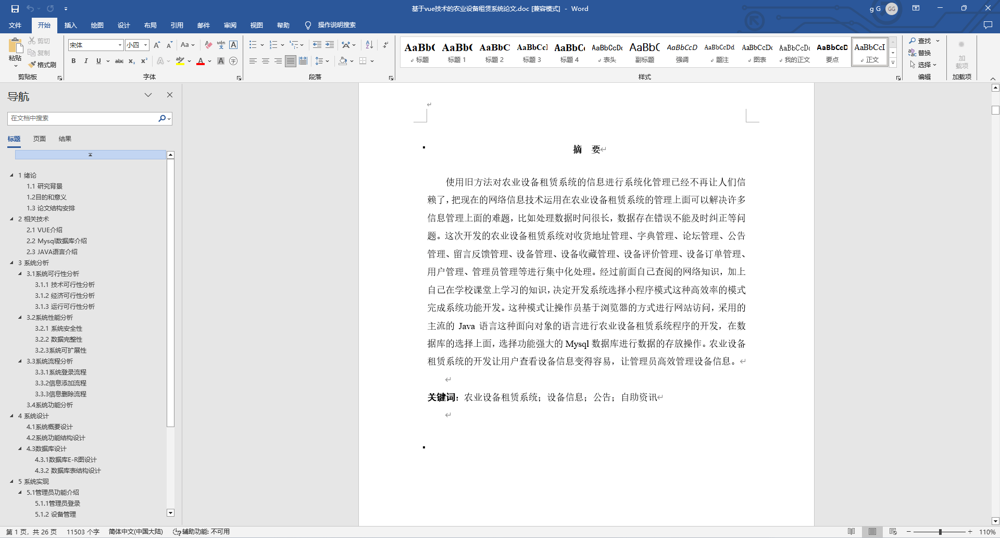
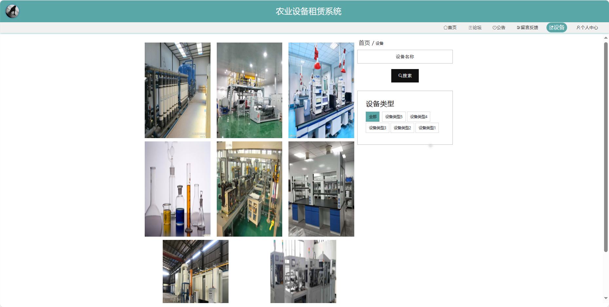
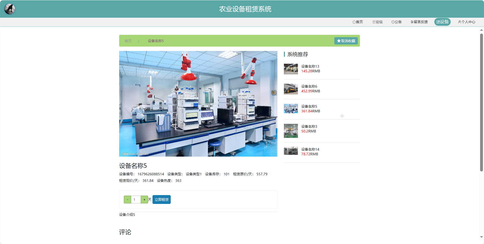
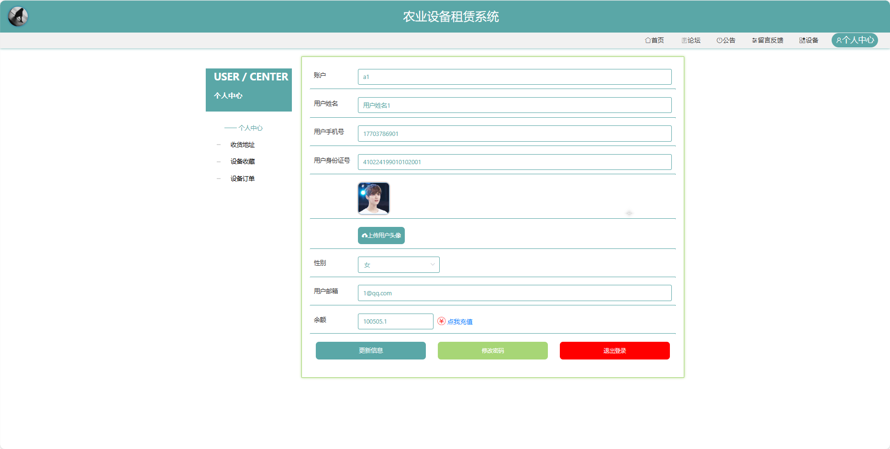
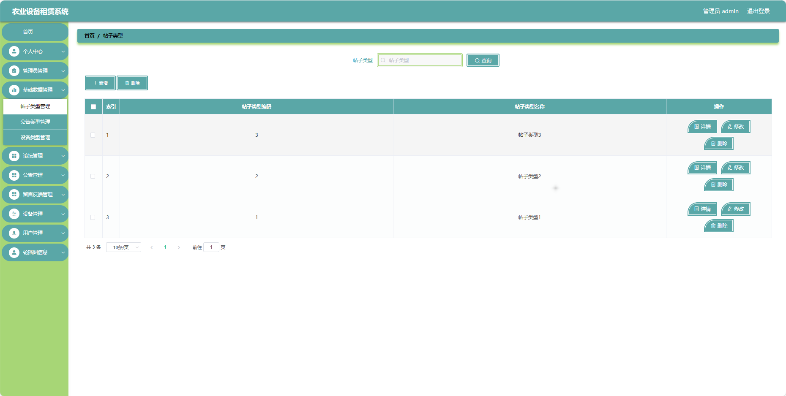
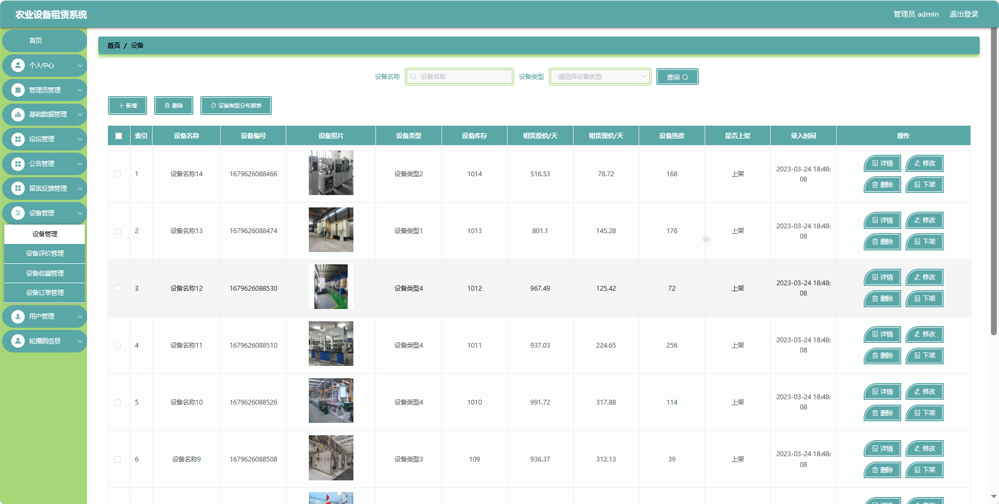
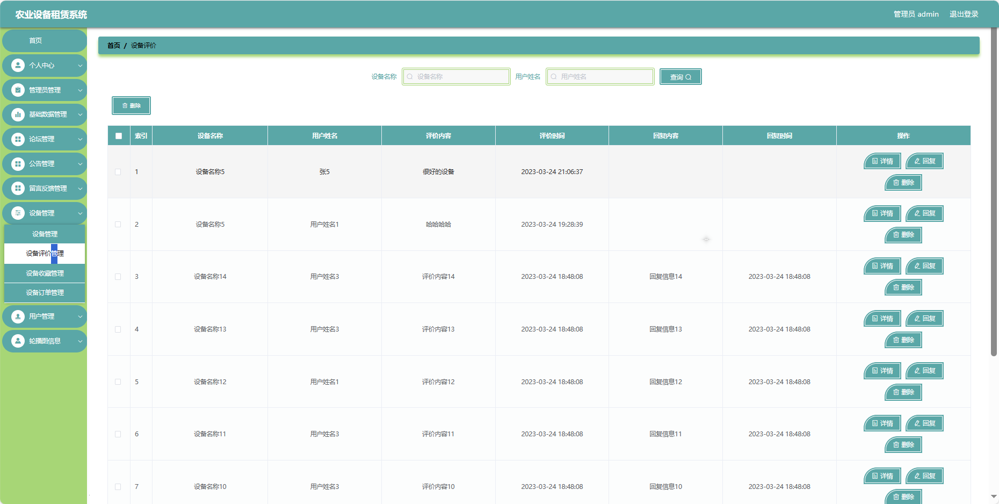
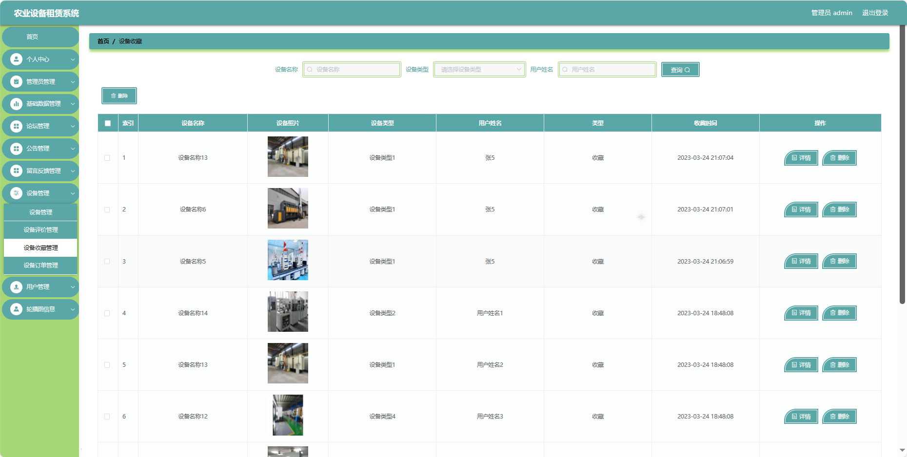

## 基于VUE的农业设备租赁系统(程序+报告)

###  获取sql数据库文件: 从戎源码网 (https://armycodes.com/) QQ: 386869957 QQ群: 377586148
###  所有系统地址: (https://github.com/YuLin-Coder/AllProjectCatalog) 
###  所有项目以及源代码本人均调试运行无问题 可支持远程安装部署调试、定制修改、代码讲解

## 项目介绍
基于VUE的农业设备租赁系统，系统包含两种角色：管理员、用户主要功能如下。

### 【管理员】:
首页：查看系统整体概况。
个人中心：管理个人信息。
管理员管理：管理系统的管理员账户。
基础数据管理：管理系统的基础数据。
论坛管理：监管和管理论坛的内容，。
公告管理：发布、编辑和删除系统公告。
留言反馈管理：查看和处理用户的留言反馈。
设备管理：管理农业设备的信息，设备上架、下架等。
用户管理：管理系统注册用户的信息。
轮播图信息：管理系统首页轮播图的内容和展示顺序。

### 【用户】:
首页：查看系统的基本信息。
论坛：参与用户间的交流和讨论。
公告：查看系统发布的相关通知和公告。
留言反馈：提供对系统或服务的反馈意见。
设备：浏览农业设备的租赁信息。
个人中心：管理个人信息、查看订单记录等。

## 项目技术
- 编程语言：Java
- 数据库：MySQL
- 项目管理工具：Maven
- 前端技术：HTML、CSS、JavaScript、Vue
- 后端技术：Spring、SpringMVC、MyBatis

## 运行环境
- JDK版本：JDK1.8及以上
- 开发工具：IDEA、Ecplise、Myecplise都可以
- 数据库: MySQL5.7及以上
- Maven：maven3.0及以上
- Node：14.14.0及以上

## 运行截图

